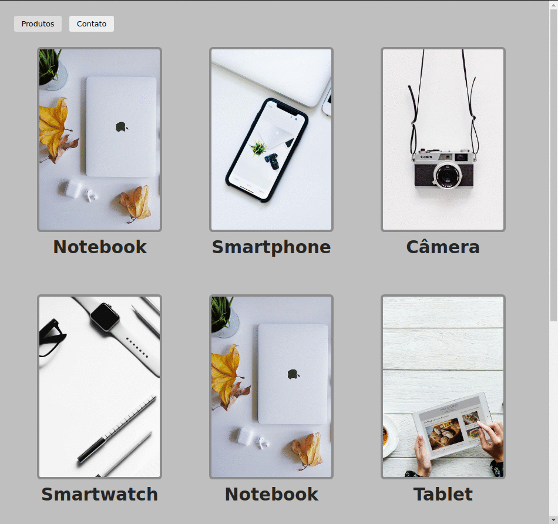

# projetosDiversos
:mortar_board: Projetos Diversos.
<hr>

# App-produtos
[Technologies](#Technologies-app-produtos)  |  [How To Use](#how-to-use-app-produtos)  |  [My Purpose](#my-purpose-app-produtos) | [Challenge I Faced ](#challenge-i-faced-app-produtos)
<br>


========================= ## =========================
<a id="Technologies-app-produtos"></a>

### < Technologies />

This project was developed in origami with the following technologies:

[Reactjs](https://reactjs.org/)
[React-router-dom](https://www.npmjs.com/package/react-router-dom)
[CSS Módules](https://create-react-app.dev/docs/adding-a-css-modules-stylesheet/)

========================= ## =========================
<a id="how-to-use-app-produtos"></a>

### < How To Use />
To clone and run this application, you will need Git, Node.js v14.15 or higher installed on your computer. From your command line:

```
 Clone this repository
$ git clone https://github.com/Marcelllombm/projetosDiversos

# Go into the repository
$ cd app-produtos

# Install dependencies
$ npm install

# Run the app
$ npm start
```
========================= ## =========================
<a id="my-purpose-app-produtos"></a>

### < My Purpose />

The purpose of this project is to practice React-router-dom

========================= ## =========================
<a id="challenge-i-faced-app-produtos"></a>

### < Challenge I Faced />
As the tutorial was a bit old, it was necessary to search the documentation for the new way to use React-router-dom
<hr>
