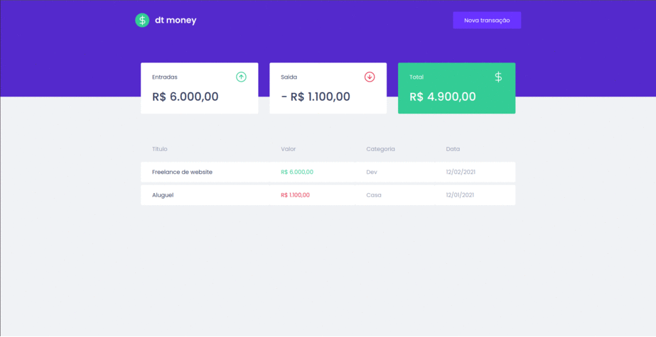
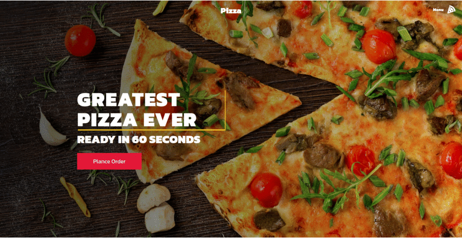

# projetosDiversos
:mortar_board: Projetos Diversos.

# Dt Money
[Technologies](#Technologies-dt-money)  |  [How To Use](#how-to-use-dt-money)  |  [My Purpose](#my-purpose-dt-money) | [Challenge I Faced ](#challenge-i-faced-dt-money)
</br></br>


========================= ## =========================
<a id="Technologies-dt-money"></a>

### < Technologies />

:arrow_right: This project was developed by youtube Brian Design with the following technologies:

- [Reactjs](https://reactjs.org/)
- [Styled-components](https://www.npmjs.com/package/styled-components)
- [React-modal](https://github.com/reactjs/react-modal#api-documentation)
- [Axios](https://axios-http.com/)
- [Miragejs](https://miragejs.com/)
- [Polished](https://polished.js.org/)
- [Typescript](https://www.typescriptlang.org/)


========================= ## =========================
<a id="how-to-use-dt-money"></a>

### < How To Use />
:hash: To clone and run this application, you will need Git, Node.js v14.15 or higher installed on your computer. From your command line:

```
# Clone this repository
$ git clone https://github.com/Marcelllombm/projetosDiversos

# Enter the branch dt-money
$ git checkout dt-money

# Go into the repository
$ cd dt-money

# Install dependencies
$ npm install

# Run the app
$ npm start
```
========================= ## =========================
<a id="my-purpose-dt-money"></a>

### < My Purpose />

:dart: The objectives of this project are: 
First, practice typescripting.
Second, passing props through parent to child components.
Third, use usecontext hook and create a custom hook.
Fourth: use the miragejs library to simulate an api.

========================= ## =========================
<a id="challenge-i-faced-dt-money"></a>

### < Challenge I Faced />
:cyclone: use typescript in reactjs and miragejs.


<hr>

# Pizza website
[Technologies](#Technologies-pizza-website)  |  [How To Use](#how-to-use-pizza-website)  |  [My Purpose](#my-purpose-pizza-website) | [Challenge I Faced ](#challenge-i-faced-pizza-websites)
</br></br>


========================= ## =========================
<a id="Technologies-pizza-website"></a>

### < Technologies />

:arrow_right: This project was developed by youtube Brian Design with the following technologies:

- [Reactjs](https://reactjs.org/)
- [Styled-components](https://www.npmjs.com/package/styled-components)
- [React-router](https://www.npmjs.com/package/react-router)
- [React-icons](https://www.npmjs.com/package/react-icons)


========================= ## =========================
<a id="how-to-use-pizza-website"></a>

### < How To Use />
:hash: To clone and run this application, you will need Git, Node.js v14.15 or higher installed on your computer. From your command line:

```
# Clone this repository
$ git clone https://github.com/Marcelllombm/projetosDiversos

# Enter the branch pizza-website
$ git checkout pizza-website

# Go into the repository
$ cd pizza-website

# Install dependencies
$ npm install

# Run the app
$ npm start
```
========================= ## =========================
<a id="my-purpose-pizza-website"></a>

### < My Purpose />

:dart: The objectives of this project are: First, to practice the stylized components; Second, folder structure.

========================= ## =========================
<a id="challenge-i-faced-pizza-website"></a>

### < Challenge I Faced />
:cyclone: Leave the traditional concept of CSS. Learn a new modern CSS.

<hr>

# App-produtos
[Technologies](#Technologies-app-produtos)  |  [How To Use](#how-to-use-app-produtos)  |  [My Purpose](#my-purpose-app-produtos) | [Challenge I Faced ](#challenge-i-faced-app-produtos)
</br></br>


========================= ## =========================
<a id="Technologies-app-produtos"></a>

### < Technologies />

:arrow_right: This project was developed in origami with the following technologies:

- [Reactjs](https://reactjs.org/)
- [React-router-dom](https://www.npmjs.com/package/react-router-dom)
- [CSS Módules](https://create-react-app.dev/docs/adding-a-css-modules-stylesheet/)

========================= ## =========================
<a id="how-to-use-app-produtos"></a>

### < How To Use />
:hash: To clone and run this application, you will need Git, Node.js v14.15 or higher installed on your computer. From your command line:

```
# Clone this repository
$ git clone https://github.com/Marcelllombm/projetosDiversos

# Enter the branch app-produtos
$ git checkout app-produtos

# Go into the repository
$ cd app-produtos

# Install dependencies
$ npm install

# Run the app
$ npm start
```
========================= ## =========================
<a id="my-purpose-app-produtos"></a>

### < My Purpose />

:dart: The purpose of this project is to practice React-router-dom

========================= ## =========================
<a id="challenge-i-faced-app-produtos"></a>

### < Challenge I Faced />
:cyclone: As the tutorial was a bit old, it was necessary to search the documentation for the new way to use React-router-dom
<hr>
